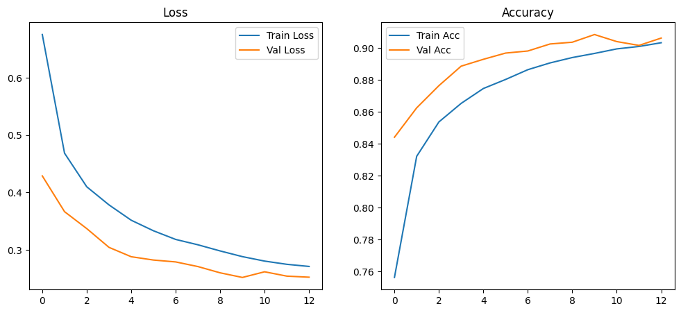
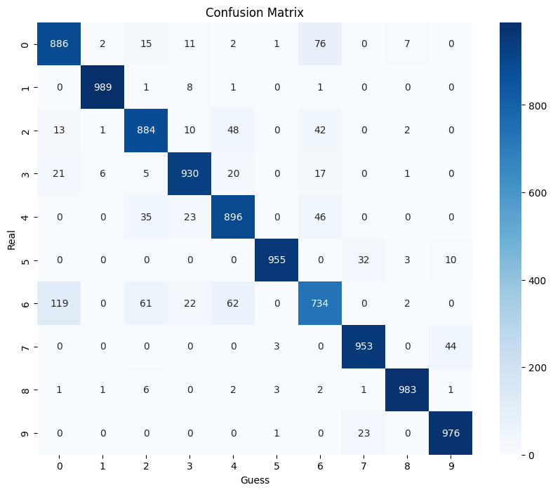

# FashionMNIST CNN Eğitimi ve Değerlendirme

Bu proje, **FashionMNIST** veri seti üzerinde bir **Convolutional Neural Network (CNN)** modeli eğitmek, doğrulamak ve test etmek için hazırlanmıştır. Kod, erken durdurma (Early Stopping) ve en iyi modelin kaydedilmesini (Checkpoint) destekler.

[Kaggle Notebook](https://www.kaggle.com/code/elifoskanba/fashion-mnist-cnn)

---

## Özellikler
- **Veri Seti:** Fashion-MNIST
- **Kategoriler:**
  - T-shirt/top
  - Trouser (Pantolon)
  - Pullover (Kazak)
  - Dress (Elbise)
  - Coat (Ceket)
  - Sandal
  - Shirt (Gömlek)
  - Sneaker (Spor Ayakkabı)
  - Bag (Çanta)
  - Ankle boot (Bilek Botu)

- **Veri Yükleme:** CSV formatındaki FashionMNIST veri seti kullanılır. `label` sütunu sınıf etiketlerini içerir.

- **Veri Dönüşümleri (Transforms):**
  - Görüntüler 32x32 boyutuna yeniden boyutlandırılır.
  - Tensör formatına dönüştürülür ve normalize edilir.
  - Eğitim setine ek veri artırma uygulanır (dönme, yatay çevirme).

- **Model:** 2 convolution + pooling katmanı, 1 dense katman, dropout, 10 sınıf çıkışı.
  - Conv1: 32 filtre, kernel=3x3, ReLU
  - MaxPool1: 2x2
  - Conv2: 64  filtre, kernel=3x3, ReLU
  - MaxPool2: 2x2
  - Dense: 128 nöron, ReLU
  - Dropout: 0.5
  - Output: 10 sınıf, Softmax

- **Eğitim:**
  - Loss: `CrossEntropyLoss`
  - Optimizer: `Adam` (lr=0.001)
  - Epoch: 20 (erken durdurma ile)
  - Early stopping: 3 epoch boyunca iyileşme yoksa durdurma
- **Değerlendirme:**
  - Test doğruluğu (Accuracy)
  - Confusion matrix
  - Classification report

---

## Kullanım

### 1. Veri Yükleme
```python
train_csv = "/kaggle/input/fashionmnist/fashion-mnist_train.csv"
test_csv  = "/kaggle/input/fashionmnist/fashion-mnist_test.csv"

train_data = FashionMNISTDataset(train_csv, transform=transform)
test_data  = FashionMNISTDataset(test_csv, transform=transform)
```

### 2. DataLoader
```python
train_loader = DataLoader(train_data, batch_size=64, shuffle=True)
val_loader   = DataLoader(val_data, batch_size=64, shuffle=False)
test_loader  = DataLoader(test_data, batch_size=64, shuffle=False)
```

### 3. Model Eğitimi
```python
model = CNN().to(device)
criterion = nn.CrossEntropyLoss()
optimizer = optim.Adam(model.parameters(), lr=1e-3)
```

### 4. Eğitim ve Doğrulama Döngüsü

- Model her epoch sonunda doğrulama kaybına göre kontrol edilir.
- En iyi model best_model.pth olarak kaydedilir.
- Early stopping ile gereksiz eğitim önlenir.

### 5. Performans Görselleştirme
```python
plt.plot(train_losses, label="Train Loss")
plt.plot(val_losses, label="Val Loss")
plt.title("Loss")
plt.show()
```

### 6. Test Değerlendirmesi
```python
test_acc = np.mean(np.array(all_preds) == np.array(all_labels))
print(f"Test Accuracy: {test_acc:.4f}")
```
- Eğitilen CNN modelinin Loss ve Accuracy grafikleri


- Eğitilen CNN modelinin sınıflar bazında precision, recall ve f1-score değerleri aşağıdaki gibidir:

##### Kernel 3x3, Dropout 0.5, Batch Size = 64
```yaml

       0       0.85      0.89      0.87      1000
       1       0.99      0.99      0.99      1000
       2       0.88      0.88      0.88      1000
       3       0.93      0.93      0.93      1000
       4       0.87      0.90      0.88      1000
       5       0.99      0.95      0.97      1000
       6       0.80      0.73      0.77      1000
       7       0.94      0.95      0.95      1000
       8       0.98      0.98      0.98      1000
       9       0.95      0.98      0.96      1000
accuracy                           0.92     10000
```

##### Kernel 5x5, Dropout 0.5, Batch Size = 64
```yaml

       0       0.86      0.85      0.86      1000
       1       0.99      0.98      0.98      1000
       2       0.87      0.87      0.87      1000
       3       0.91      0.91      0.91      1000
       4       0.86      0.86      0.86      1000
       5       0.99      0.96      0.98      1000
       6       0.73      0.75      0.74      1000
       7       0.94      0.97      0.95      1000
       8       0.99      0.97      0.98      1000
       9       0.96      0.96      0.96      1000
accuracy                           0.91      10000
```

##### Kernel 3x3, Dropout 0.3, Batch Size = 64
```yaml

       0       0.87      0.87      0.87      1000
       1       0.99      0.99      0.99      1000
       2       0.86      0.89      0.88      1000
       3       0.91      0.93      0.92      1000
       4       0.86      0.90      0.88      1000
       5       0.99      0.98      0.98      1000
       6       0.80      0.72      0.76      1000
       7       0.96      0.97      0.96      1000
       8       0.98      0.98      0.98      1000
       9       0.97      0.97      0.97      1000
accuracy                           0.92     10000
```

##### Kernel 3x3, Dropout 0.5, Batch Size = 128
```yaml

       0       0.82      0.92      0.87      1000
       1       0.99      0.98      0.99      1000
       2       0.86      0.90      0.88      1000
       3       0.92      0.93      0.92      1000
       4       0.86      0.88      0.87      1000
       5       0.98      0.98      0.98      1000
       6       0.83      0.67      0.74      1000
       7       0.95      0.97      0.96      1000
       8       0.98      0.98      0.98      1000
       9       0.97      0.96      0.97      1000
accuracy                           0.92     10000
```

- Eğitilen CNN modelinin class bazında Confusion Matrix değerlendirmesi

- **Genel doğruluk oldukça yüksek**: Çoğu classın köşegenindeki değerler 850–990 aralığında ve çok belirgin hatalar az.
- Model, Fashion-MNIST gibi 10 classlı bir veri seti için gayet başarılı.

### Class Bazlı Yorumlar
| Class         | Doğru Tahmin | Dikkat Çeken Hatalar |
|---------------|-------------|----------------------|
| **T-shirt/top** | 886 | En çok **Shirt (91)** ve bir miktar Pullover, Dress ve Bag ile karışmış. T-shirt ile gömlek görsel olarak benzer. |
| **Trouser**     | 989 | Neredeyse mükemmel, çok az hata (toplam ~14 yanlış). |
| **Pullover**    | 884 | En çok **Shirt (56)** ve **Coat (29)** ile karışıyor. |
| **Dress**       | 930 | **Shirt (41)**, **T-shirt/top (32)** ve **Coat (22)** ile karışma var. |
| **Coat**        | 896 | **Shirt (66)** ve **Pullover (59)** ile sıkça karışıyor. |
| **Sandal**      | 955 | Mükemmel; nadiren Sneaker/Ankle boot ile karışmış. |
| **Shirt**       | 734 | En zor sınıf. Çok sayıda T-shirt/top (99), Pullover (63), Coat (64) ile karışıyor. |
| **Sneaker**     | 953 | Yüksek doğruluk. |
| **Bag**         | 983 | Mükemmel performans. |
| **Ankle boot**  | 976 | Yüksek doğruluk, ufak tefek Sneaker (38) karışması var. |


### Gereksinimler

- Python 3.x
- pandas
- numpy
- torch (PyTorch)
- torchvision
- matplotlib
- seaborn
- scikit-learn
- Pillow (PIL)

### Notlar

- Kod, GPU kullanılabiliyorsa otomatik olarak GPU'yu kullanır.
- Data augmentation yalnızca eğitim veri setine uygulanır.
- Early stopping, en iyi doğrulama kaybı noktasındaki model ağırlıklarını kaydeder.
